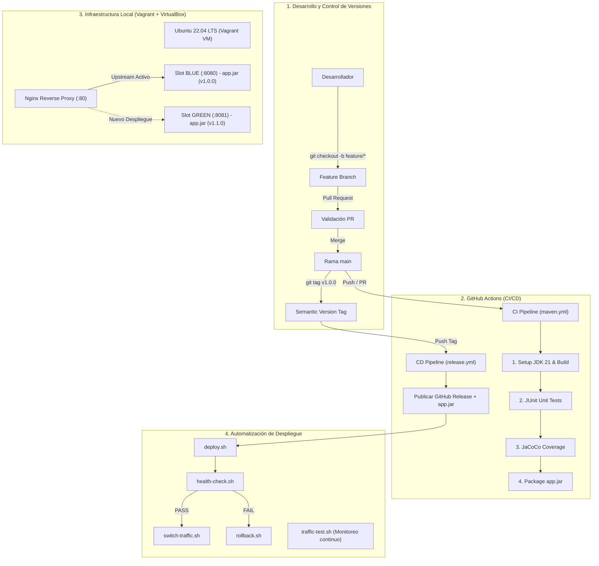

# 🚀 Proyecto Final — Implementación de CI/CD con Blue-Green Deployment

Este repositorio contiene la solución completa del Proyecto Final del Diplomado en **DevOps & CI/CD**, integrando integración continua con **GitHub Actions**, análisis de cobertura de código con **JaCoCo**, empaquetado de artefactos versionados, publicación de **GitHub Releases**, aprovisionamiento de infraestructura automatizada con **Vagrant + VirtualBox** y despliegue **Blue-Green** sin tiempo de inactividad con **Nginx** y mecanismo de **Rollback automático**.

---

## 📑 Tabla de Contenidos
1. [Arquitectura del Sistema](#-arquitectura-del-sistema)
2. [Tecnologías Utilizadas](#-tecnologías-utilizadas)
3. [Estructura del Repositorio](#-estructura-del-repositorio)
4. [Estrategia de Ramas (Branching)](#-estrategia-de-ramas-branching)
5. [Estrategia de Versionamiento (Semantic Versioning)](#-estrategia-de-versionamiento-semantic-versioning)
6. [Pipelines de CI/CD (GitHub Actions)](#-pipelines-de-cicd-github-actions)
7. [Análisis de Cobertura de Código (JaCoCo)](#-análisis-de-cobertura-de-código-jacoco)
8. [Infraestructura Local (Vagrant + VirtualBox)](#-infraestructura-local-vagrant--virtualbox)
9. [Estrategia de Despliegue Blue-Green](#-estrategia-de-despliegue-blue-green)
10. [Mecanismo de Rollback](#-mecanismo-de-rollback)
11. [Endpoints de la API](#-endpoints-de-la-api)
12. [Guía de Ejecución y Demostración](#-guía-de-ejecución-y-demostración)
13. [Checklist de Evidencias para la Defensa](#-checklist-de-evidencias-para-la-defensa)

---

## 🏛️ Arquitectura del Sistema



---

## 🛠️ Tecnologías Utilizadas

* **Lenguaje & Framework**: Java 21 LTS, Spring Boot 4.x / 3.x
* **Gestor de Construcción**: Apache Maven con Maven Wrapper (`mvnw`)
* **Pruebas Unitarias**: JUnit 5, Spring Boot Test, MockMvc
* **Cobertura de Código**: JaCoCo (`jacoco-maven-plugin`)
* **Control de Versiones**: Git & GitHub
* **Automatización CI/CD**: GitHub Actions Workflows (`maven.yml`, `release.yml`)
* **Repositorio de Versiones**: GitHub Releases
* **Virtualización**: Oracle VM VirtualBox + HashiCorp Vagrant
* **Servidor Web / Reverse Proxy**: Nginx
* **Scripting**: Bash Scripting modular

---

## 📁 Estructura del Repositorio

```text
proyecto-final/
├── .github/
│   └── workflows/
│       ├── maven.yml            # Pipeline de Integración Continua (CI)
│       └── release.yml          # Pipeline de Entrega Continua / Release (CD)
├── scripts/
│   ├── deploy.sh                # Script principal de despliegue Blue-Green
│   ├── health-check.sh          # Sondeo y validación de /health
│   ├── switch-traffic.sh        # Conmutación de upstream en Nginx
│   ├── rollback.sh              # Procedimiento de aislamiento y rollback
│   └── traffic-test.sh          # Prueba de tráfico y balanceo en vivo
├── src/
│   ├── main/java/com/cicd/webapi/
│   │   ├── Calculator.java      # Lógica de negocio (operaciones aritméticas)
│   │   └── WebapiApplication.java # Endpoints REST de la aplicación
│   └── test/java/com/cicd/webapi/
│       ├── CalculatorTest.java  # Pruebas unitarias completas
│       └── WebapiApplicationTests.java # Pruebas de integración de endpoints
├── pom.xml                      # Descriptor Maven con JaCoCo y nombre final 'app'
├── Vagrantfile                  # Definición y aprovisionamiento automático de la VM
├── CHANGELOG.md                 # Registro histórico de versiones
└── README.md                    # Documentación técnica completa
```

---

## 🌿 Estrategia de Ramas (Branching)

Se implementa una estrategia de ramas basada en **Feature Branch Workflow**:

```text
main  ──────────────────────────────────────────●─────────────
        \                                      / (Merge PR)
         \── feature/calculadora-endpoints ───/
```

### Reglas de Trabajo:
1. **`main`**: Rama principal y protegida. Contiene únicamente código estable, probado y listo para producción.
2. **`feature/*`**: Ramas de desarrollo creadas a partir de `main` para cada funcionalidad o corrección (ej: `feature/endpoints-adicionales`).
3. **Pull Request (PR)**: Ningún cambio ingresa a `main` directamente. Se crea un PR que dispara el pipeline de CI (`maven.yml`) garantizando que todos los tests pasen antes del merge.

---

## 🏷️ Estrategia de Versionamiento (Semantic Versioning)

El proyecto utiliza **Semantic Versioning 2.0.0** con el formato `vMAJOR.MINOR.PATCH`:

* **`MAJOR`**: Cambios incompatibles con versiones anteriores (breaking changes).
* **`MINOR`**: Nuevas funcionalidades retrocompatibles (ej: `v1.1.0` con nuevos endpoints).
* **`PATCH`**: Correcciones de errores retrocompatibles (ej: `v1.0.1`).

### Flujo de Release:
```text
git tag v1.0.0 ➔ git push origin v1.0.0 ➔ GitHub Action 'release.yml' ➔ GitHub Release + app.jar
```

---

## ⚙️ Pipelines de CI/CD (GitHub Actions)

### 1. Pipeline de CI (`.github/workflows/maven.yml`)
Se activa ante `push` o `pull_request` en `main` y `feature/**`:
1. **Checkout**: Descarga el código fuente.
2. **Setup JDK 21**: Configura Java 21 Eclipse Temurin con caché Maven.
3. **Compile**: Compila el código fuente (`mvn -B compile`).
4. **Unit Tests**: Ejecuta la suite de pruebas JUnit (`mvn -B test`). Si un test falla, el pipeline se detiene.
5. **Code Coverage**: Genera el reporte de cobertura JaCoCo (`mvn -B jacoco:report`).
6. **Package**: Empaqueta el artefacto ejecutable `target/app.jar`.
7. **Upload Artifacts**: Publica el JAR, el reporte de tests y el reporte de cobertura como artefactos descargables.

### 2. Pipeline de CD / Release (`.github/workflows/release.yml`)
Se activa al empujar un tag `v*.*.*`:
1. Compila y valida el código.
2. Empaqueta el archivo `app.jar`.
3. Crea automáticamente una **GitHub Release** pública y le adjunta el archivo `app.jar`.

---

## 📊 Análisis de Cobertura de Código (JaCoCo)

JaCoCo permite conocer con precisión qué porcentaje del código fuente está validado mediante pruebas automatizadas:

* **Líneas de código (Lines)**: Porcentaje de líneas ejecutadas por las pruebas.
* **Ramas lógicas (Branches)**: Validación de caminos `if/else`, excepciones y casos de borde.
* **Métodos y Clases (Methods/Classes)**: Validación de la estructura del proyecto.

> El reporte HTML interactivo se genera en `target/site/jacoco/index.html`.

---

## 💻 Infraestructura Local (Vagrant + VirtualBox)

La máquina virtual se crea y aprovisiona completamente con un solo comando:

```bash
# Iniciar y aprovisionar la máquina virtual
vagrant up

# Conectarse vía SSH a la máquina virtual
vagrant ssh
```

### Características de la VM:
* **Sistema Operativo**: Ubuntu Server 22.04 LTS (`bento/ubuntu-22.04`)
* **Recursos**: 2 vCPUs, 2048 MB RAM
* **Puertos Mapeados**:
  * Host `80` ➔ Guest `80` (Nginx Reverse Proxy)
  * Host `8080` ➔ Guest `8080` (Instancia BLUE)
  * Host `8081` ➔ Guest `8081` (Instancia GREEN)
* **Directorio Compartido**: `/vagrant` sincronizado con la raíz del proyecto en Windows.

---

## 🔄 Estrategia de Despliegue Blue-Green

La estrategia Blue-Green utiliza dos entornos de ejecución idénticos:

* **BLUE**: Instancia corriendo en el puerto `:8080`.
* **GREEN**: Instancia corriendo en el puerto `:8081`.
* **Nginx**: Actúa como proxy inverso en el puerto `:80`, dirigiendo todo el tráfico al entorno activo.

### Proceso de Despliegue:
1. Si **BLUE** está activo en producción:
2. El script `deploy.sh` despliega la nueva versión en **GREEN** (`:8081`).
3. El script `health-check.sh` sondea repetidamente `http://127.0.0.1:8081/health`.
4. Cuando responde `{"status":"UP"}`, `switch-traffic.sh` actualiza Nginx y ejecuta `nginx -s reload`.
5. El tráfico pasa instantáneamente a **GREEN** con **cero tiempo de inactividad (*Zero Downtime*)**.

---

## 🛡️ Mecanismo de Rollback

Si durante el despliegue de una nueva versión en el slot inactivo (ej. GREEN) el health check falla:

1. El script `deploy.sh` detecta el fallo HTTP o timeout.
2. Invoca automáticamente `scripts/rollback.sh`.
3. Detiene y aísla el proceso defectuoso en el puerto 8081.
4. Asegura que la configuración de Nginx mantenga el 100% del tráfico apuntando a la versión estable anterior (**BLUE** en `:8080`).
5. La experiencia del usuario nunca se ve interrumpida.

---

## 🌐 Endpoints de la API

| Método | Endpoint | Descripción | Respuesta de Ejemplo |
| :--- | :--- | :--- | :--- |
| `GET` | `/` | Información general | `{"message":"Hello CI/CD World!","status":"running"}` |
| `GET` | `/health` | Health Check | `{"status":"UP","message":"Server Healthy!"}` |
| `GET` | `/api/instance` | **Identificador Blue-Green** | `{"instance":"BLUE","port":"8080","version":"1.0.0","status":"ACTIVE"}` |
| `GET` | `/date` | Fecha actual del servidor | `{"date":"2026-09-02"}` |
| `GET` | `/api/info` | Metadatos de la VM / Java | `{"application":"Diplomado CI/CD WebAPI","java_version":"21.0.5"}` |
| `GET` | `/api/calc/add?a=10&b=20` | Suma de números | `{"operation":"add","a":10,"b":20,"result":30}` |
| `GET` | `/api/calc/multiply?a=5&b=6` | Multiplicación | `{"operation":"multiply","a":5,"b":6,"result":30}` |

---

## 🚀 Guía de Ejecución y Demostración

### 1. Compilación y Pruebas Locales (Windows)
```powershell
# Ejecutar pruebas y generar reporte JaCoCo
.\mvnw.cmd clean test

# Empaquetar el archivo ejecutable app.jar
.\mvnw.cmd package -DskipTests
```

### 2. Iniciar la Infraestructura Virtual (Vagrant)
```powershell
vagrant up
vagrant ssh
```

### 3. Ejecutar Despliegue en la VM (Linux)
```bash
# Dentro de la VM (/vagrant)
cd /vagrant

# Desplegar versión inicial v1.0.0 en BLUE
./scripts/deploy.sh v1.0.0 blue

# En otra terminal o en segundo plano, iniciar monitoreo de tráfico
./scripts/traffic-test.sh http://localhost 30 1

# Desplegar versión v1.1.0 en GREEN (observar el cambio sin caída)
./scripts/deploy.sh v1.1.0 green

# Simular despliegue defectuoso para verificar Rollback
./scripts/rollback.sh green
```

---

## 📷 Checklist de Evidencias para la Defensa

- [x] **Git / GitHub**: Ramas `main` y `feature/*`, Pull Request con merge exitoso.
- [x] **Semantic Versioning**: Tag `v1.0.0` y `v1.1.0` empujados a GitHub.
- [x] **GitHub Actions**: Pipeline de CI `maven.yml` ejecutado en verde con steps de Build, JUnit, JaCoCo y Packaging.
- [x] **JaCoCo Report**: Captura de `target/site/jacoco/index.html` con cobertura > 85%.
- [x] **GitHub Release**: Vista de la release con tag y `app.jar` adjunto.
- [x] **Vagrant / VirtualBox**: VM en estado `running` y servicios Java 21 / Nginx activos.
- [x] **Blue-Green Deployment**: Despliegue de `BLUE` (:8080) y `GREEN` (:8081).
- [x] **Traffic Switch**: Salida de `traffic-test.sh` mostrando el cambio fluido de `BLUE` a `GREEN`.
- [x] **Rollback**: Ejecución de rollback ante un fallo simulado manteniendo la versión estable.
